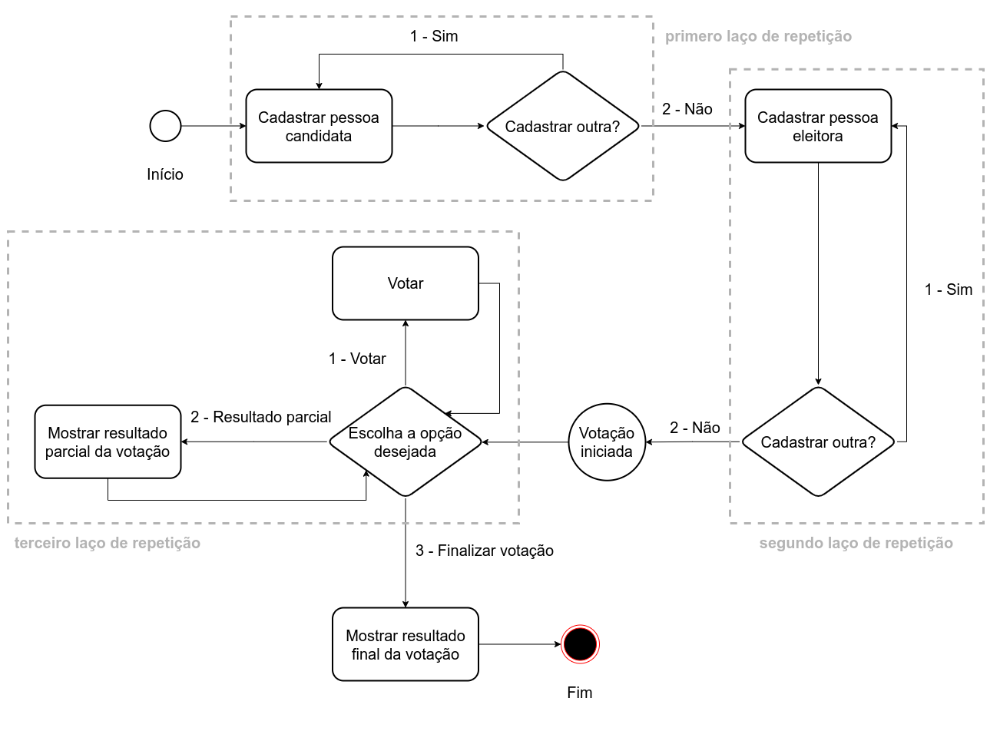

<h1 align="center">VOTING-SYSTEM</h1>

É sistema de votação eletrônico. esse sistema permite o cadastro das pessoas candidatas, o cadastro de pessoas eleitoras, realização do processo de votação e a consulta do resultado tanto parcial quanto final da votação.

A imagem a seguir representa o fluxo do sistema de forma gráfica.



## Exemplo

Aqui tempos um exemplo do funcionamento desse sistema, considerando a saída completa do console. Nesse exemplo, temos duas pessoas candidatas, Maria e José, e três pessoas eleitoras, João, Rute e Raquel. Supondo que João e Rute votaram em Maria e que Raquel votou em José, teremos a seguinte saída:

```
----------- Bem-vindo ao Sistema de Votação -----------

Cadastrar pessoa candidata?
1 - Sim
2 - Não
Entre com o número correspondente à opção desejada:
1
Entre com o nome da pessoa candidata:
Maria
Entre com o número da pessoa candidata:
1
Cadastrar pessoa candidata?
1 - Sim
2 - Não
Entre com o número correspondente à opção desejada:
1
Entre com o nome da pessoa candidata:
José
Entre com o número da pessoa candidata:
2
Cadastrar pessoa candidata?
1 - Sim
2 - Não
Entre com o número correspondente à opção desejada:
2


----------- Cadastre as pessoas eleitoras -----------

Cadastrar pessoa eleitora?
1 - Sim
2 - Não
Entre com o número correspondente à opção desejada:
1
Entre com o nome da pessoa eleitora:
João
Entre com o cpf da pessoa eleitora:
154.118.560-94
Cadastrar pessoa eleitora?
1 - Sim
2 - Não
Entre com o número correspondente à opção desejada:
1
Entre com o nome da pessoa eleitora:
Rute
Entre com o cpf da pessoa eleitora:
589.292.640-00
Cadastrar pessoa eleitora?
1 - Sim
2 - Não
Entre com o número correspondente à opção desejada:
1
Entre com o nome da pessoa eleitora:
Raquel
Entre com o cpf da pessoa eleitora:
023.476.580-18
Cadastrar pessoa eleitora?
1 - Sim
2 - Não
Entre com o número correspondente à opção desejada:
2


----------- Votação iniciada! -----------

Entre com o número correspondente à opção desejada:
1 - Votar
2 - Resultado Parcial
3 - Finalizar Votação
1
Entre com o cpf da pessoa eleitora:
154.118.560-94
Entre com o número da pessoa candidata:
1
Entre com o número correspondente à opção desejada:
1 - Votar
2 - Resultado Parcial
3 - Finalizar Votação
1
Entre com o cpf da pessoa eleitora:
589.292.640-00
Entre com o número da pessoa candidata:
1
Entre com o número correspondente à opção desejada:
1 - Votar
2 - Resultado Parcial
3 - Finalizar Votação
1
Entre com o cpf da pessoa eleitora:
023.476.580-18
Entre com o número da pessoa candidata:
2
Entre com o número correspondente à opção desejada:
1 - Votar
2 - Resultado Parcial
3 - Finalizar Votação
3
Nome: Maria - 2 votos ( 67.0% )
Nome: José - 1 votos ( 33.0% )
Total de votos: 3
```
---

### Languagens/Frameworks/Ferramentas

[](https://skillicons.dev)

## 🚀 Instalando o projeto

Para instalar o projeto, siga estas etapas:

```
mvn install
```
